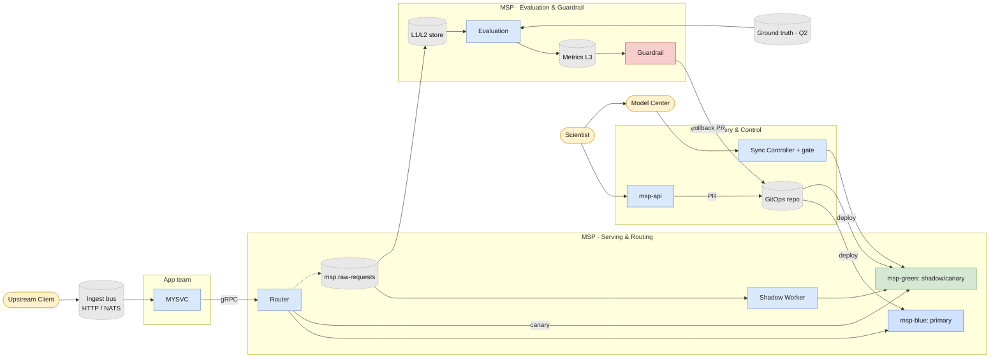

# MSP-SPEC-001 — Model Serving Platform 設計文件與規格

**Status**: v1.0 — 凍結供實作(2026-08-13;經兩輪 grill review 與一致性審查)
**Scope**: Self-service model serving platform — model onboarding, shadow run, canary rollout, evaluation, traffic promotion
**Audience**: 本文件同時作為架構設計文件與 Claude Code 實作規格
**遺留項**: Q7 容量參數(§1.5,Phase 2 前必填)、Q2 ground truth 來源(Phase 4 前必填);其餘變更走 spec 修訂流程

---

## 1. 目標與範圍

### 1.1 目標

建立一個讓 scientist self-service 的 model serving 平台:

1. Upstream data 經 MYSVC(呼叫端,§2.3)進入平台,由 Router 依 routing 規則送到 primary model(blue)進行 inference
2. Scientist 以宣告式方式 onboard 新版模型(模型來自 model center,以 k8s container 形式 sync 下來)
3. **Shadow run**:全流量鏡射到一到多個新版模型做 inference,output 不回傳,僅供 evaluation
4. **Canary rollout**:驗證後,依比例或 device id 將真實流量逐步導入新版模型(green),比較線上 performance
5. **Observability**:accuracy、latency、drift 等指標可視化,scientist 可自行判讀
6. **Promotion / Rollback**:全量切換到新版,或秒級回退

### 1.2 非目標(Out of Scope for v1)

- Model training / retraining pipeline(屬 model center 職責)
- Feature store
- Multi-region 部署(單一 fab site 起步)

### 1.3 核心設計原則

| 原則 | 說明 |
|---|---|
| **Immutability** | 驗證過的版本與上線的版本必須 bit-for-bit 相同。image 以 digest 鎖定,參數封裝在 image 內 |
| **Contract over trust** | 平台對模型的所有假設寫成 contract,由 conformance test 自動把關,不靠文件與自覺 |
| **Declarative everything** | 部署、路由、晉升全部是 GitOps repo 的宣告,有完整 audit trail |
| **Shadow 不影響 primary** | Shadow 路徑完全非同步,任何 shadow 故障不得增加 primary latency 或 error rate |
| **職責分界** | Model center 負責「模型是什麼」;本平台負責「模型如何被路由、驗證、晉升」 |

### 1.4 系統邊界與責任矩陣

| 角色 | 擁有 | 明確不擁有 |
|---|---|---|
| **Scientist** | 模型內容、參數、golden samples、判讀評估數據、決定何時 promote(經核准流程) | K8s 與部署細節、routing 機制 |
| **Model Center** | 訓練、打包(遵循 MSP-CONTRACT §4)、版本命名(同 model 唯一)、training lineage | 部署後的路由、驗證、晉升 |
| **MSP 平台**(平台團隊,本 spec) | Sync/conformance、routing、shadow/canary/promotion、evaluation、metrics、msp-api | 模型內容(不解讀 payload)、業務判讀邏輯 |
| **MYSVC**(application 團隊,MYSVC-SPEC-001) | Input 消費、模型呼叫、業務判讀與下游流程 | Model version 與位置(Router 職責)、版本相依前/後處理(model image 職責,§2.3) |

各邊界之介面(每條邊界皆以明確 contract 維繫):

| 邊界 | 介面 |
|---|---|
| Scientist ↔ Model Center | 既有發布流程 + SDK/base image(§4.5) |
| Model Center ↔ MSP | Container image + MSP-CONTRACT(§4)+ version 唯一性(§5.4) |
| MSP ↔ MYSVC | Envelope gRPC(§4.1)+ payload schema 演進規則(§2.3) |
| Scientist ↔ MSP | msp-api / CLI(§10) |

跨界變更規則:任一介面的 breaking change 需通知對側 owner 並於 PR 標注;文件歸屬——本 spec 屬平台團隊,MYSVC-SPEC-001 屬 application 團隊,MSP-CONTRACT 變更需雙方會簽。

### 1.5 容量參數(Q7 — 未填前本 spec 視為未 sized)

以下為 sizing 的必填輸入,決定 quota、partition 數、儲存與 GPU 規劃:

| 參數 | 值 |
|---|---|
| 尖峰 QPS(全部 model 合計) | TBD |
| Payload size(平均 / 最大) | TBD |
| Model 數量(現在 / 一年後) | TBD |
| 同步路徑 latency budget(p99) | TBD |
| 可用 GPU 總量(blue / green / conformance) | TBD |
| 全流量 shadow 之 GPU 成本上限 | TBD |

---

## 2. 總體架構

圖源:`msp-architecture.drawio` 為 source of truth(簡報/精修用);下方 mermaid 為 repo 內自動渲染版,兩者同步維護。



圖例:方框 = 服務;圓筒 = 資料(topic / 儲存 / repo);橢圓 = 外部角色。深藍 = production(blue)、綠 = 實驗區(green)、紅 = guardrail。

### 2.1 元件清單

| 元件 | 職責 | 建議實作 |
|---|---|---|
| **Router** | Primary 同步路由、canary weighted/pinned 路由、shadow 非同步 fan-out | Go, gRPC server + Kafka producer |
| **Sync Controller** | 從 model center 拉 image、pin digest、跑 conformance、更新 registry 狀態 | Go, kubebuilder controller |
| **Conformance Harness** | 驗證 image 是否符合 MSP-CONTRACT | Go CLI(controller 內嵌呼叫,也可獨立跑) |
| **Serving Layer** | 跑 model containers | 原生 K8s Deployment + Service + HPA,由 Sync Controller reconcile(blue / green namespaces);不使用 KServe/Knative |
| **Payload Persister + L1 Indexer** | 自 `msp.raw-requests` 落 payload 至 object store;自 `msp.predictions` 建 L1 index(§7.1) | Kafka consumers → object store (Parquet) + MariaDB index |
| **Evaluation Engine** | Paired diff、delayed ground-truth join、metrics 計算 | Java/SpringBoot 或 Go,Kafka Streams;batch join 用排程 job |
| **Metrics Store & Dashboards** | 時序指標儲存(效能/品質/健康三類)與可視化;guardrail 的資料來源(L3,§7.5) | Mimir + Grafana(既有 LGTM) |
| **Ingest (HTTP / NATS)** | Upstream client 資料進線;NATS 直接發布,HTTP 經薄 gateway 轉發布進 bus | NATS JetStream / Kafka(既有);HTTP gateway 為輕量轉接 |
| **Guardrail Engine** | 監控 canary 指標,觸發 alert / auto-rollback | Prometheus rules + 一個 rollback operator |
| **msp-api** | Self-service 門面:onboard / promote / rollback / status / 核准;寫入走 GitOps bot PR,讀取直查 registry 與 cluster(§10) | Go 或 SpringBoot, REST |
| **Scientist CLI(`msp`)/ Portal** | msp-api 的薄殼 client | CLI 優先(v1),Portal 後續 |

### 2.2 Blue/Green 拓撲與生命週期

**語意邊界**(Q5 決議之細化):

| | msp-blue | msp-green |
|---|---|---|
| 內容 | **僅** 正在服務真流量 primary 的模型 | 所有非 primary:shadow 與 canary 版本 |
| PriorityClass | 高(資源競爭時最後被犧牲) | 低 |
| ResourceQuota | 寬鬆(依 primary 需求) | 封頂(policies/ 定義,依「同時最多 N 個實驗版本」sizing) |
| 變更管制 | 最嚴(僅 promote/rollback 流程可動) | scientist self-service |

不變式:**blue 內的 workload = 受完整保護的 production**。primary 不得存在於 green。

**Namespace 生命週期**:namespace 本體(含 quota、PriorityClass、NetworkPolicy 禁外呼)屬平台 bootstrap,由 `platform/` 目錄以 GitOps 管理,常設不隨模型生滅;會動的只有其中的 ModelDeployment。

**晉升時搬家**:v4 canary → primary 的實際步驟:

```
1. 在 blue 宣告 v4 ModelDeployment(同 digest,conformance 沿用)
2. blue 的 v4 ready(切換期間 v4 短暫雙份部署——刻意的雙保險)
3. ModelRoute 切 primary → blue/v4
4. green 的 v4 ModelDeployment 退場
5. 前版 primary(blue/v3)保留 ≥ 1 週後回收
```

**Blue 容量與 release 序列化**:blue quota 必須容納「最大 model 資源 × 2」(promote 搬家期間新舊雙份,§5.4 保留政策);**同時最多 1 個 model 處於切換觀察期**(release calendar 管理),避免多 model 同期 release 疊加雙份需求。

**Green 垃圾回收**:ModelDeployment 連續 X 天(policies/ 定義,建議 14)未被任何 ModelRoute 引用 → controller 通知 model owner → 寬限期(建議 7 天)後自動回收部署;registry 記錄依 §5.4 永久保留。防止殭屍版本佔滿 green quota。

### 2.3 與 MYSVC 的關係(呼叫端整合)

MYSVC 為模型的呼叫端:自 Kafka/NATS 消費 service input,經 Router 呼叫模型(gRPC, MSP-CONTRACT envelope),取得結果後續行下游流程。

**部署形態**:MYSVC 屬平台穩定層(與 Router 同類),**單一部署**、自有 HA 與 rolling update,不隨 blue/green 複製兩套。Blue/green 是模型的發布域,非整個 cluster 的發布域。

**耦合邊界**:MYSVC 只認識「邏輯 model name + envelope + payload schema」;version 與 blue/green 位置由 Router 解析,MYSVC 對 shadow/canary/切換完全無感。

**生命週期**:MYSVC 與 model 明確**不同步**——此為 Router + MSP-CONTRACT 這層 indirection 的核心目的。兩者唯一的耦合點是 payload schema,演進規則:

1. **相容性變更**(新增 optional 欄位等):模型自由演進,MYSVC 不受影響。protobuf 前後相容規範適用,預期為絕大多數情況
2. **Breaking change**(欄位語意變更/刪除):走 expand-contract 協調發布——MYSVC 先升級為同時支援新舊 schema → 新模型走完 shadow → canary → primary → MYSVC 移除舊 schema 支援。屬一次性協調發布,非常態同步
3. Schema 的 breaking 與否由 conformance C4 對 manifest 宣告的 descriptor 判定;breaking change 需在 PR 標注並通知 MYSVC owner

**前後處理歸屬紀律**:任何隨模型版本演變的前/後處理邏輯必須封裝於 model image(§4 行為要求),不得存在於 MYSVC——否則模型切版本時 MYSVC 被迫連動,解耦失效。MYSVC 僅保留與模型版本無關的業務流程。

---

## 3. Use Case Mapping(端到端流程)

每個 use case 標注涉及元件與 spec 章節,作為整合測試場景的依據(Phase 5 驗收即 UC-1→UC-6 串起來演練)。

### UC-0 Runtime:upstream data 正常 inference(持續發生)

```
Device → Kafka/NATS(ingest) → MYSVC(consumer) → Router(gRPC)
  ├─ 同步:依 ModelRoute 判定 primary/canary → 呼叫 model Service → 回傳 MYSVC 續行下游
  │        └─ fire-and-forget 寫 msp.raw-requests(payload)+ msp.predictions(metadata)
  └─ 非同步:每筆請求進 msp.raw-requests(§7.1)→ shadow worker 依 shadow 設定消費
           → 呼叫 shadow models → 只寫 prediction log
```
涉及:MYSVC(§2.3)、Router(§6.2)、Serving、Topic 設計(§7.1)。失敗語義:canary fail-fast(Q3,MYSVC 收到錯誤依其重試/告警政策處理)、shadow 失敗零影響。

### UC-1 Scientist onboard 新版模型 → shadow

```
1. Scientist 用 SDK 做好 v4,發布到 model center(§4.5)
2. msp onboard defect-cls v4 → POST /versions(§10.2)
3. msp-api 驗 RBAC → bot 開 PR(ModelDeployment, target=green)→ CI 過 auto-merge(§10.3)
4. Sync Controller:拉 image → pin digest → conformance C1–C7(§4.4, §5)
5. 通過 → Deployable → reconcile Deployment/Service/HPA → Deployed
6. Deployed 後平台自動將 v4 加入 ModelRoute 的 shadow 項(onboard 預設含 shadow,無獨立指令)
7. 全流量開始鏡射,evaluation 開始累積(§7)
```
失敗分支:conformance 不過 → status=Rejected,`msp status` 顯示失敗條目,scientist 修正後以新 version 重來(不可覆蓋,§4.3-3)。

### UC-2 判讀 shadow 結果,決定是否晉升

```
1. msp status defect-cls v4 → agreement ratio、accuracy(如 label 已到)、Grafana link
2. Scientist 看 L2/L3 數據(§7.5):paired diff 一致率、差異分布、混淆遷移
3. 數據不佳 → 回 UC-1 出 v5;數據 OK → 進 UC-3
```
判準分兩層(§10.1-6):**硬條件由 API 強制**——shadow 時長 ≥ N 天(含週期性 pattern)、shadow_miss_ratio ≤ 門檻;**判讀參考供人決策**——agreement(變化偵測器,§7.2 語義)、disagreement drill-down、accuracy 與 unlabeled_ratio。

### UC-3 Canary:pilot → 放量

```
1. msp promote v4 --canary --pin CVD-101,CVD-102 → PR → model owner + on-call 核准(§10.3)
2. 低風險機台先跑;Grafana 看 blue vs green 系統指標(§7.4)
3. msp promote v4 --canary --weight 10 → 核准 → hash 分桶放量(sticky,§6.1)
4. 逐步 10 → 30 → 60(每步一 PR 一核准);weight 調升不洗牌既有 canary devices(§6.1 sticky)
```

### UC-4 Guardrail 觸發 → rollback

```
1. canary error_rate / primary > 2.0 持續 10m(ModelRoute.guardrails)
2. Guardrail Engine → rollback operator:開 PR(weight→0)+ 最高等級 page(§8)
3. On-call 人工核准(Q4)→ merge → Router 秒級生效
4. Audit log 記觸發指標快照;scientist 回 UC-1 修正
```
Exposure window 緩解依 §8-4。

### UC-5 全量切換與退場

```
1. msp promote v4 --primary → PR → 正式 change lane 核准(§10.3)
2. 平台於 blue 部署 v4(同 digest,conformance 沿用)→ ready(§2.2 搬家步驟)
3. ModelRoute:primary=blue/v4 weight 100,canary 清空;green 的 v4 退場
4. 前版 v3 保留部署但不接流量(即時回退用);觀察期(≥ 1 週)後刪除 → controller 回收資源
5. v3 image 與 digest 記錄保留在 registry DB(可追溯、可重新部署);release record 寫入(§5.4)
```

### UC-6 稽核與回溯

```
- 「上週三流量比例?」→ git log routes/defect-cls.yaml
- 「這筆判定當時是哪個模型?」→ L1 以 request_id 查(含 model_digest)
- 「誰核准了放量?」→ audit log(operationId ↔ PR ↔ 核准人)
- 「v4 上線前後 accuracy 趨勢?」→ L3 Grafana(13 個月保留)
```

### 元件 × Use Case 對照

| | UC-0 | UC-1 | UC-2 | UC-3 | UC-4 | UC-5 | UC-6 |
|---|---|---|---|---|---|---|---|
| Router | ● | | | ● | ● | ● | |
| Sync Controller | | ● | | | | ● | |
| Conformance | | ● | | | | | |
| msp-api / CLI | | ● | ● | ● | ● | ● | ● |
| Prediction Log (L1) | ● | | ● | | | | ● |
| Evaluation (L2) | | | ● | ● | | | ● |
| Mimir (L3) | | | ● | ● | ● | ● | ● |
| Guardrail | | | | ● | ● | | |
| GitOps repo | | ● | | ● | ● | ● | ● |
## 4. MSP-CONTRACT — Model Contract 規格

平台對每一個 model image 的完整要求。**Scientist 發布到 model center 的模型必須遵循本節**;平台以 conformance test 強制執行。

### 4.1 Predict API(gRPC)

所有模型 expose 統一 gRPC service,port `8080`,以 envelope 包裝:

```protobuf
syntax = "proto3";
package msp.serving.v1;

import "google/protobuf/timestamp.proto";

service ModelService {
  rpc Predict(PredictRequest) returns (PredictResponse);
  rpc Health(HealthRequest) returns (HealthResponse);
}

message PredictRequest {
  string request_id  = 1;   // 平台產生,全鏈路追蹤用
  string device_id   = 2;
  string model_name  = 3;
  google.protobuf.Timestamp ingest_time = 4;
  bytes  payload     = 5;   // model-specific,schema 由 model-manifest 宣告
  map<string, string> metadata = 6;
}

message PredictResponse {
  string request_id     = 1;
  string model_name     = 2;
  string model_version  = 3;
  string model_digest   = 4;   // image digest,模型啟動時自 manifest 讀入
  bytes  payload        = 5;   // model-specific output
  Status status         = 6;
  int64  inference_ms   = 7;
}

enum Status {
  OK = 0;
  INVALID_INPUT = 1;
  INTERNAL_ERROR = 2;
}

message HealthRequest {}
message HealthResponse {
  bool ready = 1;
  string detail = 2;
}
```

Payload 內容(input/output 的實際 schema)由各模型以 protobuf descriptor 或 JSON Schema 宣告在 model-manifest 中;平台不解讀 payload 內容,只驗 envelope 與 schema 一致性。

### 4.2 model-manifest.yaml

固定放在 image 內 `/opt/msp/model-manifest.yaml`:

```yaml
apiVersion: msp/v1
kind: ModelManifest
model:
  name: defect-cls
  version: v4
  description: "Defect classification, retrained 2026-08"
contract:
  protocol: grpc
  port: 8080
  inputSchema:            # protobuf descriptor 或 JSON Schema 擇一
    type: protobuf
    descriptor: /opt/msp/schemas/input.desc
    messageType: fab.defect.v2.WaferImage
  outputSchema:
    type: protobuf
    descriptor: /opt/msp/schemas/output.desc
    messageType: fab.defect.v2.DefectResult
runtime:
  resources:
    requests: {cpu: "2", memory: 4Gi, nvidia.com/gpu: 1}
    limits:   {cpu: "4", memory: 8Gi, nvidia.com/gpu: 1}
  startupSeconds: 120     # conformance 與 readiness 的等待上限
comparisonPolicy: exact   # exact | numeric:<epsilon> | top-k:<k>
                          # C6 與線上 paired diff 共用此 policy;
                          # 非確定性模型(GPU 浮點、sampling)必須宣告非 exact
goldenSamples:            # conformance 用的樣本,image 內附
  - input: /opt/msp/golden/sample-01.bin
    output: /opt/msp/golden/expected-01.bin
    tolerance: exact      # exact | numeric:<epsilon>,未指定則繼承 comparisonPolicy
```

### 4.3 行為要求

1. **Self-contained**:容器在斷網、無外掛 volume、無額外環境變數的情況下,`startupSeconds` 內必須 ready 並能正確 inference。所有 model parameters(threshold、preprocessing config 等)封裝在 image 內。
2. **Stateless**:不得在本地保存跨 request 狀態;同一 input 在任何副本上結果一致。
3. **Immutable version**:任何行為改變(含只改 threshold)= 新 version = 新 image。平台一律以 digest 引用。
4. **禁止外呼**:inference 過程不得呼叫任何外部服務。具體 NetworkPolicy(存 platform/policies,**C2 沙盒與 blue/green namespace 引用同一份 manifest**,保證 conformance 通過 = 線上可跑):egress 僅允許 DNS,其餘全拒(含 model-to-model、DB、任何平台服務);ingress 僅允許 Router、shadow worker、conformance harness。GPU 存取經 device plugin,非網路路徑,不受影響。
5. **Runtime input 驗證**:SDK/base image 對每筆 input payload 做嚴格 schema 驗證,不符即回 `INVALID_INPUT`(不進 predict)。呼叫端(MYSVC)視 INVALID_INPUT 為不可重試 → DLQ;平台監控 `msp_invalid_input_rate`,突增即告警——schema 飄移由告警發現,而非產線。

### 4.4 Conformance Test 條目

Sync controller 拉下 image 後、標記 deployable 前必須全數通過:

| # | 測項 | 驗證方式 |
|---|---|---|
| C1 | Manifest 存在且 schema 合法 | 解析 `/opt/msp/model-manifest.yaml` |
| C2 | 斷網啟動 | 在 no-egress network policy 的沙盒 namespace 啟動,`startupSeconds` 內 Health ready |
| C3 | Envelope 合規 | 以合法/非法 envelope 打 Predict,驗回應與 Status 行為 |
| C4 | Schema 一致 | Input/output payload 與 manifest 宣告的 descriptor 驗證 |
| C5 | Golden sample | 全部 golden samples 打入,輸出符合 expected(依 tolerance) |
| C6 | 冪等 | 同一 golden input 打 3 次,輸出一致 |
| C7 | 資源宣告 | manifest resources 在平台允許範圍內 |

失敗即 reject,回報失敗項目與 log;不進 registry。

**Conformance 資源**:專用 conformance GPU pool(獨立 quota,卡數見 §1.5 Q7)+ 佇列;`msp_conformance_queue_depth` 進 metrics,佇列等待 > **5 分鐘**告警(與 §10.1 onboard SLO p90 ≤ 15 分鐘對齊——SLO 含佇列時間,pool 容量以 p90 佇列 ≈ 0 為 sizing 目標),防止 conformance 成為 scientist 迭代瓶頸。

### 4.5 Scientist SDK / Base Image

提供 base image(Python)內建:gRPC server、envelope 處理、manifest 載入、health。Scientist 只實作:

```python
class Model(msp.BaseModel):
    def load(self):        # 讀取 weights 與 config(皆在 image 內)
        ...
    def predict(self, payload: bytes) -> bytes:
        ...
```

參數放 `/opt/msp/config/` 內,隨 image 版本化。

---

## 5. Sync Controller — Model Center 整合

### 5.1 職責

1. 監看 GitOps repo 中的 `ModelDeployment` 宣告
2. 從 model center registry 拉取指定 model/version 的 image
3. **解析並鎖定 digest**:寫回 ModelDeployment(`spec.modelRef.digest`)並記錄 registry DB
4. 執行 conformance test(§4.4)
5. 通過後將 image 標記為 `deployable`,推入平台內部 registry(隔離 model center 後續覆蓋)

### 5.2 ModelDeployment CRD

```yaml
apiVersion: msp.platform/v1
kind: ModelDeployment
metadata:
  name: defect-cls-v4
  namespace: msp-green
spec:
  modelRef:
    source: model-center
    model: defect-cls
    version: v4
    digest: ""            # sync controller 解析後填入並鎖定;非空則不再變動
  cluster: green          # 邏輯 target:blue | green。v1 皆映射到同 cluster 的
                          # msp-blue / msp-green namespace;target→實體位置的映射
                          # 由平台 config 定義,未來搬實體雙 cluster 只改映射
  replicas: {min: 2, max: 8}
  # 資源取自 model-manifest,此處僅允許 override 上限
  # HPA metric:自訂指標 msp_inference_inflight(per-pod 並行請求數,經
  # Prometheus adapter),輔以 GPU utilization(DCGM);禁用 CPU-based HPA
status:
  phase: Syncing | ConformanceRunning | Deployable | Deployed | Rejected
  conformance:
    passed: [C1, C2, C3, C4, C5, C6, C7]
    failed: []
  pinnedDigest: sha256:...
```

### 5.3 狀態機

```
Declared → Syncing → ConformanceRunning → Deployable → Deployed
                            └──────────▶ Rejected(附失敗報告)
```

Digest 一旦寫入即不可變;若 scientist 需要新內容,必須宣告新 version。

### 5.4 版本治理與 Release 管理

**版本的三個身份層**

1. 版本號(如 `v4`):model center 指定,平台視為 opaque string,僅強制同 model 下唯一且不可重用(含 Rejected 過的)
2. Digest:真正的身份,平台內部一律以 digest 引用
3. Registry 記錄:每版本一筆完整檔案——digest、model center 來源 ref、conformance 報告、lifecycle 歷史(actor/時間/stage)、evaluation 快照

**每版本的完整狀態機**(§5.3 為前段,此為全生命週期):

```
Registered → Deployable → Shadow → Canary → Primary → Retired
     └─ Rejected              └────┴─ RolledBack ─┘
```

不變式:每 model 同時最多 1 個 Primary、1 個 Canary、N 個 Shadow。所有轉移經 GitOps PR;`git log` 即版本演進史。

**Release Record(evidence-based release)**

每次 primary 切換由平台自動寫入 registry DB:

```sql
CREATE TABLE msp_release (
  model            VARCHAR(64),
  release_seq      BIGINT,        -- 該 model 的第 N 次 release
  from_version     VARCHAR(32),
  to_version       VARCHAR(32),
  to_digest        VARCHAR(80),
  approved_by      VARCHAR(64),
  pr_url           VARCHAR(256),
  released_at      DATETIME,
  eval_snapshot    JSON,          -- 切換當下:agreement、accuracy、canary 期間指標
  rollback_of      BIGINT NULL,   -- 若本次為回退,指向被回退的 release_seq
  PRIMARY KEY (model, release_seq)
);
```

**Rollback 與退場政策**

- 前版 primary 於切換後保持部署 ≥ 1 週(§3 UC-5);回退 = route PR,秒級生效,並記一筆 release(`rollback_of` 標注)
- Retired 刪除部署,registry 記錄與 digest **永久保留**;任何歷史版本可重新部署(重新宣告 ModelDeployment 即可,conformance 結果沿用)
- Image blob 保留政策:至少保留最近 N 個曾任 primary 的版本(N 進 `policies/`,建議 5);其餘依 registry GC 週期
- Training lineage(訓練資料、參數來源)為 model center 職責;平台僅記 model center reference,不重複建檔

**Registry DB 的定位與重建**:registry DB 為**觀測狀態與歷史**(conformance 結果、release record、audit),非期望狀態——期望狀態唯一權威是 Git。衝突規則:desired state 一律以 Git 為準,reconciliation job 定期比對 Git/cluster/DB 三方,發現分歧記 event 並告警。可重建性:conformance 報告與 release record 同步歸檔至 object store(append-only),DB 全損時自 Git 歷史 + object store 歸檔重放重建;DB 依 fab 既有 MariaDB HA/備份標準運行。

**Security Rebuild Lane(CVE 應對)**:base image 出現安全漏洞時的批次流程——model center 對受影響模型批次 rebuild(僅換 base layer,weights/config 不動)→ 各出新 version → conformance 全跑(golden samples 保證行為不變)→ 走**縮短 shadow(24h)+ 核准**的快速通道晉升。此流程依賴 model center 支援批次 rebuild,列為跨界需求(§1.4);受影響版本清單由平台自 registry 依 base image digest 反查產生。

---

## 6. Router 與 ModelRoute

### 6.1 ModelRoute CRD

單一 CRD 同時表達 primary / canary / shadow 三種模式,涵蓋完整 lifecycle:

```yaml
apiVersion: msp.platform/v1
kind: ModelRoute
metadata:
  name: defect-cls
spec:
  model: defect-cls
  primary:
    version: v3               # primary 流量 = 100 - canary.weight(不另設欄位,避免加總不一致)
  canary:                     # 可為空
    version: v4
    weight: 10                # 比例制;與 pinnedDevices 可並存(聯集)
    pinnedDevices:            # 指定機台 pilot
      - CVD-101
      - CVD-102
    sticky:
      key: device_id          # hash(device_id) → bucket,保證同 device 固定版本
      seed: "defect-cls-2026" # 換 seed 才會重新洗牌
  shadow:                      # 可多個
    - version: v4
      sampling: 100            # 百分比;預設全流量
    - version: v5-exp
      sampling: 100
  guardrails:
    - metric: error_rate
      comparator: ratio_gt     # canary / primary 比值
      threshold: 2.0
      window: 10m
      action: rollback         # rollback | alert
    - metric: latency_p99_ms
      comparator: ratio_gt
      threshold: 1.5
      window: 10m
      action: alert
```

### 6.2 Router 行為

**呼叫端介面(多協定門面)**:Router 核心邏輯僅一份;對外提供兩個門:
- **gRPC(主)**:MSP-CONTRACT envelope(§4.1),MYSVC 與高頻服務走此門
- **HTTP/REST(輔)**:以 grpc-gateway 自 proto 自動生成,零手寫轉譯;binary payload 以 base64 傳遞(體積 +33%,低頻呼叫端可接受)。供無法用 gRPC 的呼叫端與快速測試(curl)使用
- 兩門進入後共用同一路由邏輯(sticky/weighted/breaker/shadow);呼叫端需帶 `caller_id`(metadata),per-caller 計量與限流(policies/ 定額)
- NATS 非同步門 v1 不做:與 MYSVC 角色重疊,待出現「純 inference、無業務流程」的非同步呼叫端再議

1. **Primary/Canary(同步路徑)**
   - 讀 route:若 device_id ∈ pinnedDevices → canary;否則 `hash(device_id, seed) mod 100 < canary.weight` → canary;其餘 → primary
   - Sticky:同一 device 在 seed 不變下永遠落同一邊
   - 呼叫對應 model Service(K8s Service → Deployment),回傳結果給呼叫端
   - 同步寫 prediction log(fire-and-forget 到 Kafka)
2. **Shadow(非同步路徑)**
   - Router 將每筆請求(含 payload)寫入 `msp.raw-requests`(§7.1);shadow worker 依 route 的 shadow 設定與 sampling 過濾消費
   - 獨立的 shadow-worker consumer 呼叫 shadow model Services,結果只寫 prediction log;worker 以 KEDA 對 Kafka lag 自動擴縮
   - **失敗隔離**:shadow worker 任何錯誤(模型掛、超時)只記 metrics,絕不影響同步路徑
3. **Route 更新**:Router watch ModelRoute CRD,更新為原子切換(收到新 config 後整份替換)。多副本一致性:config 帶 **activation timestamp**(merge 時間 + 傳播緩衝,預設 +10s)——`activateAt` 前一律用舊 config,到達後用新 config。誠實聲明:此機制把不一致窗口自「config 傳播時間(秒級)」縮至「副本間時鐘偏移」,**非零**;前提為 node NTP 同步(偏移監控納入平台告警),殘餘窗口對 sticky 的影響視為可接受
4. **Canary 失敗處理(Q3 修訂)**:per-request 維持 fail-fast——單次 canary 失敗回錯誤、記 guardrail 指標,不做 silent fallback。但 Router 對每個 version 維護 **circuit breaker**:短窗口內連續失敗(預設 10s 內 ≥ 5 次或失敗率 ≥ 50%,policies/ 可調)→ breaker open → 該 version 的 canary 流量暫時導回 primary,同時發 `msp_circuit_open` metric + 告警(circuit open 本身是 guardrail 訊號,由人決定是否 rollback)。half-open 探測恢復(探測流量見 §6.2-5)。**Breaker 為 per-replica 語義**(刻意決策:保持 Router 路由決策純本地、無共享狀態)——閾值以單副本計,可能出現副本間 open/closed 不一致的中間態;全域視角由 `msp_circuit_open`(per replica label)metrics 與 guardrail 提供,不在資料面引入一致性協調。此設計避免 sticky + 呼叫端重試造成特定 device 的資料連續失敗灌入 DLQ
5. **Half-open 探測用合成請求**:breaker 恢復探測不使用產線真實流量——Router 以內建 golden probe(源自 Phase 0 流量產生器,golden sample based)打目標 version,連續 N 次成功(預設 3)才 close、真實流量回流。產線資料不當探測彈

### 6.3 Lifecycle 狀態機(每個 model 一條)

```
        onboard             evaluate OK           gradual              all green
v4: ── shadow(100%) ──▶ canary(pinned/weight%) ──▶ weight 遞增 ──▶ primary(v4), v3 退場
             │                    │ guardrail 觸發
             ▼                    ▼
          rejected            rollback(weight→0,秒級)
```

每一步都是 GitOps repo 的一個 PR;promotion 條件與核准流程接 SRE change management 的 lane 定義。

---

## 7. Evaluation Pipeline

### 7.1 Topic 設計與 Prediction Log

**兩個 topic,payload 只進 Kafka 一次**:

1. **`msp.raw-requests`**(大、短命):完整 envelope payload。Producer:Router(每筆同步請求,fire-and-forget)。**Retention 短(預設 24h,policies/ 可調,壓縮開啟)= shadow 可容忍的最大 lag**。兩個 consumer group:
   - **Shadow worker**:直接自此讀 payload 做 shadow inference(不需回頭 fetch object store)
   - **Payload persister**:payload 落 object store(Parquet,按日分區)+ MariaDB index——L1 的長期形態
2. **`msp.predictions`**(小、metadata):所有 inference 輸出的記錄。Schema:request_id, device_id, model_name, **intended_version, actual_version, breaker_state**, model_digest, route_mode(primary|canary|shadow), ingest_time, payload_in_ref, payload_out_ref, status, inference_ms。Producer:Router(primary/canary)與 shadow worker(shadow)。Consumer:L1 indexer

**Shadow lag 與資料完整性**:shadow lag 超過 raw retention = 該段 shadow 資料**永久缺失**(僅影響 shadow,不影響 primary 與 L1——persister 有獨立 consumer group 且優先擴容)。監控 `msp_shadow_lag_seconds`,達 retention 50% 告警;缺失計入 shadow_miss(§7.2)。

### 7.2 兩種比較,分屬兩個階段

| 比較 | 階段 | 方法 | 時效 |
|---|---|---|---|
| **Paired diff** | Shadow | 同一 request_id 下 shadow output vs primary output:一致率、差異分布、混淆遷移矩陣 | 即時(streaming join on request_id;語義見下) |
| **Accuracy vs ground truth** | Shadow + Canary | Prediction join ground truth 來源(Q2 定義)| 延遲(依來源),batch job 定時 join |
| **線上系統指標** | Canary | latency、error rate、資源用量,blue vs green | 即時(Prometheus) |

**Paired diff join 語義**(agreement 分母的正式定義):
- Join key = request_id;join window = raw topic retention + 1h margin(預設 25h);狀態存 Kafka Streams state store(RocksDB),TTL = window
- Window 內雙方到齊 → 成對,進 agreement 分子/分母
- Window 逾時 shadow 未到 → 記 **shadow_miss**,**不進 agreement 分母**,單獨計 `msp_shadow_miss_ratio`
- **完整性閘門**:shadow_miss_ratio ≤ 門檻(policies/,預設 1%)為 promotion 硬條件之一(§10.1-6)——agreement 再漂亮,樣本缺一大塊就不算數

原則:**accuracy 的主戰場在 shadow(paired、全流量、零風險);canary 驗的是真實回寫後的 end-to-end 行為**。

**Circuit breaker 與資料純度**:prediction log 同時記 `intended_version`(路由判定)與 `actual_version`(實際執行)+ `breaker_state`。**Breaker open/half-open 窗口內 intended≠actual 的紀錄一律排除於 canary 對比之外**(單獨計 `msp_breaker_affected_ratio`);canary 期間 breaker 開合頻繁本身即是不健康訊號,dashboard 標示 breaker 窗口。

**Agreement 的正確語義**:agreement ratio 是**變化偵測器,不是品質分數**——新模型修正舊模型錯誤的 case 同樣拉低 agreement。低 agreement 的意義是「變化大,需要人看」,不是「品質差」。配套:dashboard 提供 disagreement drill-down(抽樣不一致 case,含 input ref 與雙方 output,供 scientist 檢視判斷方向);品質的最終裁判是 delayed accuracy(vs ground truth)。Promotion 判準不得以 agreement 高低單獨放行或否決。

### 7.3 Ground Truth Join

- Ground truth 來源與到達延遲需在各 model 的 manifest 或平台 config 宣告(v1 先以平台 config 定義 per-model 的 join key 與 label source table)
- Batch job(排程,建議每小時)以 join key(如 lot_id + wafer_id + 時間窗)關聯 prediction 與 label,計算 accuracy/precision/recall,寫入 metrics store
- Join 不到 label 的 prediction 記為 pending,超過 TTL 標記 unlabeled 並計數(unlabeled 比例本身是重要指標)

### 7.4 Metrics(推 Mimir,label: model, version, route_mode, device_group)

- `msp_predictions_total`, `msp_prediction_errors_total`
- `msp_inference_latency_ms`(histogram)
- `msp_shadow_agreement_ratio`(paired diff 一致率)
- `msp_accuracy`, `msp_precision`, `msp_recall`(delayed)
- `msp_output_distribution`(drift 監控)
- `msp_unlabeled_ratio`

Grafana dashboard:blue vs green 並排、per-version 對比、promotion checklist 視圖。

### 7.5 Metrics Store 三層設計

各層存不同粒度、回答不同問題;guardrail 只依賴 Layer 3(低延遲),爭議時回 Layer 1 重算對賬。

| Layer | 內容 | 儲存 | 粒度 | 保留期 |
|---|---|---|---|---|
| **L1 Prediction Log** | 每筆 request 完整記錄(事實) | Parquet @ object store(按日分區)+ MariaDB index | per-request | ≥ 1 年,可重算上層 |
| **L2 Evaluation Results** | agreement ratio、accuracy/precision/recall、混淆矩陣(結論) | MariaDB evaluation 表 | (model, version, 時間窗, device_group) | ≥ 1 年 |
| **L3 Mimir 時序** | L2 聚合結果 + 系統指標(latency、error rate、QPS)(趨勢) | Mimir(既有 LGTM) | 時序,依 §7.4 label | 依 LGTM 現況(建議 ≥ 13 個月,支援年度對比) |

**資料流**:L1 是所有上層的原始依據(streaming/batch job 讀 L1 算出 L2;exporter 把 L2 + 各服務系統指標推 L3)。`msp-api /metrics/summary` 讀 L2;Grafana dashboard 與 guardrail rules 只讀 L3。

**Cardinality 規則(必須遵守)**:

1. Mimir label 只允許:`model`, `version`, `route_mode`, `device_group`——**禁止 `device_id` 與 `request_id` 進任何時序 label**。fab 機台數量會造成 cardinality 爆炸,per-device 分析一律走 L1/L2 查詢
2. `device_group` 的定義(分組規則)放 `policies/`,全平台一致
3. 新增 label 視為 breaking change,需 spec 修訂

**L2 evaluation 表 schema(最小集)**:

```sql
CREATE TABLE msp_evaluation (
  model         VARCHAR(64),
  version       VARCHAR(32),
  window_start  DATETIME,
  window_end    DATETIME,
  device_group  VARCHAR(64),
  metric        VARCHAR(32),   -- agreement_ratio | accuracy | precision | recall | unlabeled_ratio
  value         DOUBLE,
  sample_count  BIGINT,
  computed_at   DATETIME,
  PRIMARY KEY (model, version, window_start, device_group, metric)
);
-- 混淆矩陣另表,cell 級展開,同組 key
```

### 7.6 Metrics 介面與 Dashboard Provisioning

Scientist 看 metrics 的三個介面:

1. **Grafana(主要介面)**:每個 model 一個 dashboard,由平台**自動 provision**——維護一份 dashboard template(Grafana provisioning / JSON model,存 GitOps repo `platform/dashboards/`),model onboard 時 controller 以 model 名帶入 template 產生 dashboard,scientist 零設定。版面:頂部路由現況(各版本 stage/weight)→ shadow 區(agreement 趨勢、差異分布、混淆遷移)→ accuracy 區(per-version accuracy/precision/recall、unlabeled ratio)→ 系統區(blue vs green latency p50/p99、error rate、QPS)。變數選單:version、device_group、時間範圍
2. **`msp status` / `GET /metrics/summary`**:讀 L2 的決策摘要(phase、conformance、agreement、accuracy、labeled 比例)+ Grafana deep link。promote 與否看摘要即可,深入分析開 dashboard
3. **Portal(v2,暫緩)**:引導式 promotion checklist。v1 不做——Grafana + CLI 已覆蓋能力需求,portal 屬體驗優化

Template 變更即全體 dashboard 變更(重新 provision),禁止對自動產生的 dashboard 手動編輯(會被 reconcile 蓋掉);客製需求走 template PR。

---

## 8. Guardrail Engine

1. Prometheus recording rules 計算 canary/primary 比值指標
2. Alert rule 觸發後,rollback operator 收到 webhook:
   - `action: alert` → 通知(接現有 alerting 管道)
   - `action: rollback` → 自動對 GitOps repo 開 PR 將 canary weight 改 0,同時發最高等級 page 給 on-call 與 model owner。**PR 不 auto-merge,必須人工核准後才生效**(已決議,對齊 SRE change lane:自動化準備變更、人類批准變更)
3. 所有 rollback 事件記 audit log,附觸發指標快照
4. **Exposure window 注意事項**:人工核准意味著從 guardrail 觸發到 rollback 生效之間,canary 持續承接流量。緩解手段:(a) canary 初期 weight 保守(≤10%)、優先用 pinnedDevices 圈定低風險機台;(b) rollback PR 的核准 SLA 定為分鐘級並納入 on-call runbook;(c) §6.2 的 per-version circuit breaker 於連續失敗場景先行止血(circuit open 期間 canary 流量已回 primary)
5. **核准的維運要求**:approve 權限綁定 on-call rotation(非固定名單);msp-api 的 approve endpoint 必須可於手機操作(或接 ChatOps);page 後 ack SLA 5 分鐘;**上線前必須完成一次完整 rollback 演練**(guardrail 觸發 → page → 手機核准 → 生效全程走通)

---

## 9. GitOps Repo 結構

```
msp-deploy/
├── clusters/
│   ├── blue/
│   │   └── deployments/          # ModelDeployment CRDs
│   └── green/
│       └── deployments/
├── routes/                        # ModelRoute CRDs(每 model 一檔)
│   └── defect-cls.yaml
├── platform/                      # Router、controllers、namespace bootstrap
│   └── dashboards/                # dashboard template(§7.6)、NetworkPolicy(§4.3-4)
└── policies/                      # 平台策略集中地:conformance 資源上限、guardrail/breaker
                                   # 預設、promotion N/M/門檻、raw retention、GC 天數、
                                   # device_group 分組規則、target→實體位置映射
```

- Scientist 的操作面 = 對 `deployments/` 與 `routes/` 開 PR(CLI 代勞)
- CI:schema 驗證、權限檢查(scientist 只能動自己 model 的檔案)、promotion lane 規則
- ArgoCD 分別 sync blue / green / platform

---

## 10. Self-Service 介面規格(API-first)

### 10.1 設計原則

1. **API 是門面,Git 是唯一 source of truth**:所有寫入操作由 msp-api 以 bot 身份對 GitOps repo commit / 開 PR;讀取操作直查平台 registry DB 與 cluster,即時回應
2. CLI、Portal、外部自動化(如 model center 發布 webhook)一律走同一套 API,不存在旁路
3. AuthZ 收斂在 API 層(per-model RBAC);GitOps repo 僅 bot 與平台管理者有寫入權
4. 需核准的操作:API 產生 PR 後進入 pending 狀態,核准動作亦為 API endpoint(approve + merge)
5. **Onboard SLO**:onboard 提交 → shadow 開跑 **p90 ≤ 15 分鐘**(含 conformance 佇列時間)。配套:green node 對 base image pre-pull、conformance 並行執行、`msp_onboard_duration` 全程分段量測(PR/CI/sync/conformance/deploy 各段),超標段落即優化對象
6. **狀態機強制與 promotion 硬條件**:非法轉移由 **msp-api 直接拒絕**(不依賴核准者把關)——禁止跳過 shadow 直上 canary、禁止跳過 canary 直上 primary。Promotion 硬條件(API 檢查,不滿足即 4xx):shadow 時長 ≥ N 天(預設 7)、canary 時長 ≥ M 天(預設 3)、shadow_miss_ratio ≤ 門檻(§7.2)。N/M/門檻進 policies/。Agreement 與 accuracy **非**硬條件(§7.2 語義:供人判讀,per-model 可自訂 accuracy 硬門檻)。Break-glass:僅 platform-admin 可越過,需標注理由,全程 audit。Dashboard 的 promotion checklist 與 API 硬條件**讀同一份判定結果**,所見即所擋

### 10.2 API Endpoints(v1)

```
# Lifecycle 寫入(皆產生 GitOps PR)
POST /v1/models/{model}/versions
     body: {version, source: model-center}                  # onboard → shadow
POST /v1/models/{model}/routes:promote
     body: {version, stage: canary|primary, weight?, pinnedDevices?}
POST /v1/models/{model}/routes:rollback                     # canary weight → 0
POST /v1/approvals/{approvalId}:approve                     # 核准 pending 操作
POST /v1/approvals/{approvalId}:reject

# 讀取
GET  /v1/models                                             # 該使用者可見的 models
GET  /v1/models/{model}/versions/{v}/status                 # phase + conformance 報告
GET  /v1/models/{model}/route                               # 目前 ModelRoute 生效內容
GET  /v1/models/{model}/metrics/summary                     # agreement/accuracy/latency 摘要
                                                            # + Grafana deep link
GET  /v1/approvals?state=pending                            # 待核清單
```

錯誤格式統一:`{code, message, detail}`;所有寫入操作回傳 `{operationId, prUrl, state: merged|pending_approval}`。

### 10.3 核准矩陣

| 操作 | 風險 | 處理 |
|---|---|---|
| onboard → shadow | 零(不碰真流量) | CI + conformance 過即 bot auto-merge |
| shadow → canary | 真流量進入 | Model owner + 平台 on-call 各一核准 |
| canary weight 調升 | 擴大暴露 | 同上(可依 lane 分級簡化) |
| canary → primary 全量 | 全量切換 | 正式 change lane 核准 |
| rollback | 收斂風險 | 人工核准(Q4 決議);PR 由 guardrail 或 API 自動開好 + page |

梯度邏輯:**風險越低自動化越高**。Shadow 全自動,scientist 的實驗迴圈(改模型 → shadow → 看數據)不等任何人,這是 self-service 的體感關鍵;真流量操作才進審核。

### 10.4 AuthN / AuthZ

- AuthN:接現有 SSO;CLI 用 token(SSO 換發,短效)
- AuthZ:per-model RBAC,角色三種——`owner`(該 model 全部操作)、`viewer`(唯讀)、`platform-admin`(全域 + 核准權)。Canary/primary 的核准者不可為提交者本人(four-eyes)
- 所有 API 呼叫記 audit log(who / what / when / operationId ↔ PR 對映)

### 10.5 CLI 對映

`msp` CLI 為 API 薄殼,指令一對一映射:

```
msp onboard <model> <version>                → POST /versions
msp status <model> [<version>]              → GET /status
msp promote <model> <version> --canary --weight 10
msp promote <model> <version> --canary --pin CVD-101,CVD-102
msp promote <model> <version> --primary     → POST /routes:promote
msp rollback <model>                        → POST /routes:rollback
msp approvals / msp approve <id>            → approvals endpoints
```

`msp status` 輸出附 Grafana dashboard deep link,scientist 自行判讀數據決定何時 promote。

---

## 11. 實作計畫(給 Claude Code 的 phase 切分)

每個 phase 有獨立可驗收的 deliverable;依序實作,前一 phase 的介面凍結後才進下一個。

### Phase 0 — Contract 與 Conformance Harness
- 產出:`msp-contract` repo — protobuf 定義、model-manifest JSON Schema、conformance CLI(`msp-conform verify <image>`)、Python base image + SDK、一個 example model
- 產出(並行開發配套,皆為 gRPC、自 contract proto 衍生):**Router stub**(實作 envelope、回 canned response 的 gRPC server,供 MYSVC 等呼叫端在真 Router 就緒前整合測試)、**合成流量產生器**(依 envelope 產生測試流量,與 conformance C3/C5 共用程式碼,供 Router/shadow 開發測試)
- 驗收:example model 過 C1–C7;故意違反每一條的 negative case 都被抓到;MYSVC 端以 Router stub 完成一次 predict 往返;流量產生器可對 stub 與 example model 各打通一輪

### Phase 1 — Sync Controller
- 產出:kubebuilder controller,實作 §5 狀態機、digest pinning、內部 registry 推送、conformance 整合;Deployable 後 reconcile 出原生 Deployment + Service + HPA(資源取自 model-manifest)
- 驗收:宣告 ModelDeployment → 自動走到 Deployed 且 pod ready;model center 覆蓋同 version 後,平台引用不受影響;刪除 CRD 時關聯資源正確回收

### Phase 2 — Router(primary 路徑)
- 產出:Go gRPC router,ModelRoute watch、weighted + pinned + sticky 路由、activation timestamp 切換(§6.2-3)、雙 topic producer(§7.1)、HTTP 門(grpc-gateway 生成,含 caller_id 計量)
- 驗收:sticky 正確性(同 device 固定)、多副本於 activateAt 一致切換、壓測 latency overhead < 5ms p99

### Phase 3 — Shadow Fan-out + Prediction Log
- 產出:`msp.raw-requests` / `msp.predictions` topics(§7.1)、shadow worker、payload persister、L1 indexer;shadow lag 監控
- 驗收:shadow 模型故障/超時對 primary p99 零影響(chaos test);全流量下 log 無丟失(exactly-once 或可容忍的 at-least-once + 去重)

### Phase 4 — Evaluation + Dashboards
- 產出:paired diff streaming job、ground truth batch join、metrics exporter、dashboard template + 自動 provisioning(§7.6)、`/metrics/summary` 所需的 L2 查詢層
- 驗收:注入已知差異的兩個模型,agreement ratio 與 accuracy 計算正確;unlabeled TTL 邏輯正確;onboard 新 model 時 dashboard 自動出現且面板有數據

### Phase 5 — Canary Lifecycle + Guardrail + Self-Service API
- 產出:guardrail recording/alert rules、rollback operator、per-version circuit breaker + golden probe(§6.2-4/5)、**msp-api(§10 全部 endpoints + RBAC + GitOps bot + 狀態機硬條件 §10.1-6)**、`msp` CLI(API 薄殼)
- 驗收:端到端演練全程只透過 API/CLI 完成 — onboard v4 → shadow(auto-merge)→ canary 10%(核准流程)→ guardrail 觸發開 rollback PR → 人工核准生效 → 修正 → 重新晉升 → cutover;RBAC 越權操作被正確拒絕

### 技術棧約定

- Controllers / Router / Workers:Go(K8s 生態一致性)
- Evaluation batch:可用 SpringBoot(團隊既有 stack)或 Go,實作前二擇一並全程一致
- 訊息:Kafka(既有);CRD 部署:kubebuilder + ArgoCD;Serving:原生 Deployment/Service/HPA(controller reconcile),shadow worker 用 KEDA;明確不引入 KServe/Knative(v2+ 若需 scale-to-zero 或 ModelMesh 再評估,contract 不受影響)
- 所有 service 內建 OTel traces + Prometheus metrics,接 LGTM

### 給 Claude Code 的通用要求

1. 每個 repo 附 `CLAUDE.md`:模組職責、介面凍結清單、測試指令
2. Proto / CRD schema 變更視為 breaking change,需明確標註
3. 每個 phase 的驗收條目寫成自動化測試(unit + integration;chaos test 可用 toxiproxy 模擬)
4. 不實作本 spec 未定義的功能;發現 spec 缺口時先記錄 `SPEC-GAP` 註記回報,不自行腦補

---

## 12. 決策記錄與開放問題

### 12.1 已決議

| # | 問題 | 決議 |
|---|---|---|
| Q1 | Model center container API 是否統一 | **由平台制定 contract(§4),model center 端要求 scientist 遵循**。不做 adapter sidecar;conformance gate 為唯一入口 |
| Q3 | Canary 失敗時的同步路徑行為 | **Fail-fast 回錯誤**,不 fallback primary(§6.2-4);後由 Q3-R 補強 |
| Q3-R | Q3 修訂(grill review) | per-request fail-fast 不變,新增 **per-version circuit breaker**(§6.2-4):連續失敗自動短路暫回 primary,大聲告警,消除 sticky × 重試 × DLQ 的連鎖。第二輪補強:per-replica 語義(不引入共享狀態)、half-open 合成探測(§6.2-5)、breaker 窗口資料排除於 canary 對比(§7.2) |
| Q4 | Rollback PR 是否 auto-merge | **不可,必須人工核准**;operator 自動開 PR + page,exposure window 緩解見 §8-4 |
| Q5 | Blue/green 實體形式 | **v1 同 cluster 雙 namespace(msp-blue / msp-green),部署 target 抽象化**,target→實體位置由平台 config 映射,預留搬實體雙 cluster 路徑。配套要求:green namespace 設 ResourceQuota,primary workload 用較高 PriorityClass,確保 green 不得排擠 blue |
| Q6 | MYSVC → Router 的 protocol | **gRPC**(MYSVC 為 Java/SpringBoot,採 grpc-java / Spring gRPC)。理由:envelope 已是 protobuf、payload 為二進位、內部高頻 service-to-service、與 Router→model 全鏈路一致(deadline propagation 支撐 fail-fast)。原則:資料面 gRPC,管理面(msp-api)REST。實作要點:ManagedChannel 復用、withDeadlineAfter 傳遞、async stub 或 virtual threads。補充(多協定):Router 另提供 grpc-gateway 生成之 HTTP 門(§6.2),供非 gRPC 呼叫端;NATS 門 v1 不做 |
| D-K | Kafka topic 設計(grill R2) | Payload 只進 Kafka 一次:`msp.raw-requests`(全 payload、retention 24h = 最大 shadow lag)由 shadow worker 與 payload persister 兩個 group 消費;`msp.predictions` 僅 metadata(§7.1) |
| D-G | 狀態機強制(grill R2) | 非法 stage 轉移由 msp-api 拒絕;promotion 硬條件 = 時長 + 完整性(shadow_miss_ratio),agreement/accuracy 供判讀非硬擋(§10.1-6) |

### 12.2 仍開放(實作前需 J 確認)

| # | 問題 | 影響 |
|---|---|---|
| Q2 | Ground truth 的具體來源表與 join key(per model) | Phase 4 join 邏輯 |
| Q7 | 容量參數(§1.5 全表:QPS、payload、model 數、latency budget、GPU 總量與 conformance pool 卡數) | 全部 sizing;未填前不得進 Phase 2 |

---

